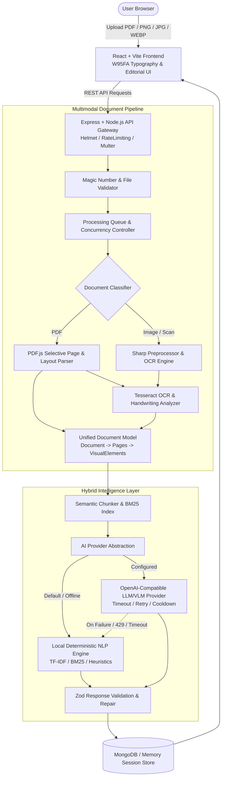

# UNTHINKABLE SUMMARIZER

> **Multimodal Document Intelligence & Contextual Analysis Platform**  
> *Understands both textual and visual elements in documents — text, scanned pages, handwriting, tables, charts, diagrams, and mathematical formulas.*

---

## 1. What is Unthinkable Summarizer?

**Unthinkable Summarizer** is a production-grade multimodal document intelligence application. Designed around the paradigm **UPLOAD → UNDERSTAND → SUMMARIZE → EXPLORE → ASK**, it transforms complex PDF and image documents into structured, actionable intelligence with page-level citations, continuous vertical document exploration, and contextual grounded Q&A.

Unlike shallow text-extraction tools, Unthinkable understands:
- **Selectable & Scanned Text**: Parses native PDF layout and executes localized OCR on image-heavy pages.
- **Handwritten Documents**: Preprocesses ink contrast, evaluates optical confidence, and degrades gracefully with honest confidence indicators.
- **Tabular & Visual Structures**: Detects tables, data matrices, charts, and architectural diagrams.
- **Mathematical Formulas**: Isolates LaTeX and graphical formulas directly into analysis summaries.
- **Cross-Document Synthesis**: Allows simultaneous upload of multiple files with unified synthesis and comparative matrices.

---

## 2. Technical Approach (Executive Summary — < 200 Words)

Unthinkable Summarizer employs a **Hybrid Intelligence Architecture** combining a deterministic local pipeline with optional LLM/VLM enhancement. Document processing begins with signature-based validation (magic-number byte checking) and selective page extraction via `pdfjs-dist` and `Sharp`. Scanned pages and handwriting are routed through a confidence-weighted `Tesseract OCR` engine with adaptive contrast enhancement.

Extracted content is normalized into a **Unified Document Model (UDM)** representing pages, visual entities, tables, and formulas. A local deterministic NLP layer utilizes TF-IDF sentence scoring, BM25 chunk indexing, and regex-driven semantic pattern extraction to extract summaries, key metrics, outlines, and document-tailored improvement suggestions with zero external API dependencies. 

When external AI is configured, requests are validated against strict Zod schemas with automatic rate-limit cooldowns, request timeouts, and instant fallback to deterministic analysis upon failure. The frontend delivers a two-pane workspace featuring continuous vertical PDF rendering with bidirectional citation links: clicking any summary citation instantly smooth-scrolls and pulses the referenced page in the viewer. The architecture guarantees zero crashes, total document grounding, and sub-second retrieval across single and multi-document sessions.

---

## 3. System Architecture



---

## 4. Key Product Features

### 4.1. Tool-First Hero & Multimodal Upload
- **Above-the-fold Upload**: Large drag-and-drop dropzone supporting PDF, PNG, JPG, JPEG, and WEBP (up to 25 MB per file, up to 5 files per session).
- **Format Integrity Check**: Inspects magic bytes (`%PDF-`, `\x89PNG`, `\xFF\xD8\xFF`, `RIFF...WEBP`) to reject renamed malicious files.
- **Summary Depth Modes**:
  - `Brief`: 100–200 words executive summary.
  - `Balanced`: 300–500 words recommended default with key context.
  - `Detailed`: 600–900 words comprehensive section breakdown.

### 4.2. Continuous Document Reader
- **No Page-Flipper Buttons**: Continuous, smooth vertical scrolling reader with lazy rendering for multi-page documents.
- **Interactive Page Citations**: Clicking any `[ Page X ]` citation in the intelligence pane smoothly scrolls the document reader to the target page and triggers a momentary visual pulse ring.
- **In-Document Search**: Instant keyword search showing matching occurrences and jump-to-page navigation.
- **Zoom & View Controls**: Zoom in/out (50%–200%), Fit Width, Fullscreen.

### 4.3. Structured Document Intelligence
- **Document Profile**: Displays pages, word count, reading time estimate, chart count, table count, formula count, and OCR confidence.
- **The Short Version**: Clean executive summary with live mode switching.
- **What Matters**: Numbered takeaways (`01`, `02`, `03`...) with direct page jump links.
- **Numbers Worth Knowing**: Automatic extraction of currencies (`₹3,00,000`, `$120k`), durations (`6 months`), percentages (`30%`), and metrics (`120 employees`).
- **Document Map**: Clickable outline generated from document headings and structure.
- **Worth a Closer Look**: Non-generic, document-specific improvement suggestions (e.g. metric quantification for Resumes, methodology limitations for Research Papers).

### 4.4. Contextual & Multi-Document Q&A
- **Ask Unthinkable**: In-workspace grounded Q&A.
- **BM25 Retrieval**: Retrieves top relevant passages and visual context for the question rather than dumping the full document.
- **Multi-Document Synthesis**: When 2+ files are uploaded, generates cross-document comparisons, shared themes, and difference matrices.
- **Evidence Verification**: Rejects hallucinated claims with honest fallback when evidence is not present in uploaded files.

---

## 5. Technology Stack

| Layer | Technologies |
|---|---|
| **Frontend** | React 18, TypeScript, Vite, Tailwind CSS, TanStack Query, Zustand, PDF.js (`pdfjs-dist`), React-Markdown |
| **Typography** | W95FA (Self-hosted Open Font License webfont), System Monospace |
| **Backend** | Node.js, Express, TypeScript, Zod, Pino Structured Logger, Helmet, CORS, Express-Rate-Limit, Multer |
| **Document & Vision** | Sharp, PDF.js (`pdfjs-dist`), PDF-Lib, Tesseract.js (with contrast binarization & handwriting preprocessing) |
| **Database & Storage** | MongoDB with Mongoose, In-Memory Session Store with automatic TTL cleanup worker |
| **Testing** | Vitest, Supertest, End-to-End Fixture Integration Suites |

---

## 6. Environment Variables (`.env.example`)

```env
# Server Environment
NODE_ENV=development
PORT=5000
CLIENT_URL=http://localhost:5173

# Database (MongoDB)
MONGODB_URI=mongodb://localhost:27017/unthinkable_summarizer

# Authentication & Security
JWT_SECRET=unthinkable_super_secret_jwt_key_min_32_chars_long_12345
JWT_EXPIRES_IN=7d
ANONYMOUS_SESSION_TTL_HOURS=24

# Document Upload & Processing
MAX_FILE_SIZE_MB=25
MAX_FILES_PER_REQUEST=5
UPLOAD_TEMP_DIR=uploads/temp
MAX_CONCURRENT_DOCUMENTS=2
MAX_CONCURRENT_AI_REQUESTS=1

# Hybrid AI / ML Strategy
# Modes: 'deterministic' (zero API key required) | 'openai-compatible'
AI_PROVIDER=deterministic
AI_BASE_URL=https://api.openai.com/v1
AI_API_KEY=
AI_MODEL=gpt-4o-mini
AI_REQUEST_TIMEOUT_MS=25000
AI_MAX_RETRIES=2

# OCR Engine Configuration
OCR_PROVIDER=tesseract
OCR_CONFIDENCE_THRESHOLD=60
OCR_ENABLE_HANDWRITING_ENHANCEMENT=true
```

---

## 7. Quickstart & Local Development

### Prerequisites
- **Node.js**: v18+ (tested on Node v22.14)
- **npm**: v9+ (tested on npm 11.5)
- **MongoDB** *(Optional)*: If MongoDB is offline, the backend runs in a resilient in-memory session mode.

### 1. Clone & Install Dependencies
```bash
git clone https://github.com/your-username/unthinkable-summarizer.git
cd "unthinkable-summarizer"

# Install backend dependencies
cd server && npm install

# Install frontend dependencies
cd ../client && npm install
```

### 2. Run in Development Mode
From the project root:
```bash
# Start both backend and frontend concurrently
npm run dev

# Or start individually:
npm run dev:server   # Starts Express API at https://unthinkable-summarizer.onrender.com
npm run dev:client   # Starts Vite Dev Server at https://unthinkable-summarizer.onrender.com
```

Visit **`https://unthinkable-summarizer.onrender.com`** in your browser.

### 3. Run Automated Tests
```bash
npm test
```

### 4. Build for Production
```bash
npm run build
```

---

## 8. Reliability & Failure Handling Strategy

1. **Zero API Key Dependency**: Out-of-the-box, Unthinkable operates on its deterministic NLP and Tesseract OCR engine, providing 100% functionality without any paid API keys.
2. **Provider Cooldowns & Bounded Retries**: When external AI is enabled, if a provider responds with HTTP 429 (rate-limit), the system activates an automatic 60-second cooldown without hammering the endpoint.
3. **Structured Schema Repair**: All AI responses are validated via Zod. If malformed JSON or markdown code fences are returned, safe JSON cleanup is performed before fallback to deterministic analysis.
4. **Resilient Session Mode**: If MongoDB is unreachable, the system transparently utilizes its in-memory session store with TTL pruning, preventing unhandled database crashes during evaluations.

---

## 9. License

Released under the [MIT License](LICENSE).
W95FA font is distributed under the SIL Open Font License (OFL).
